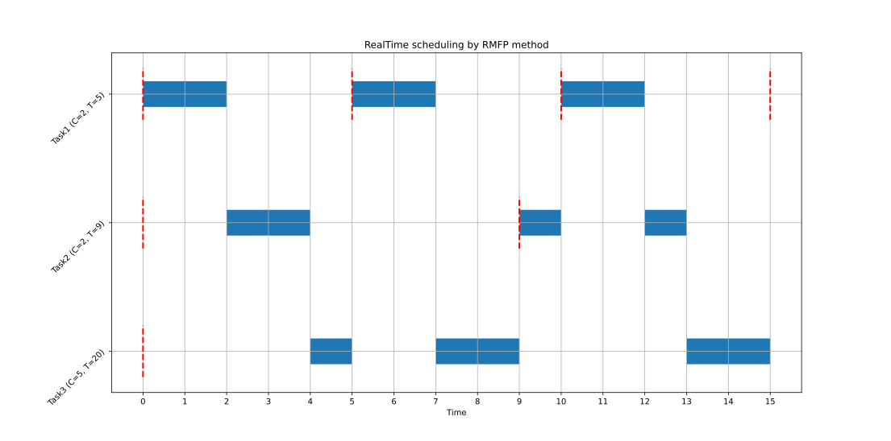
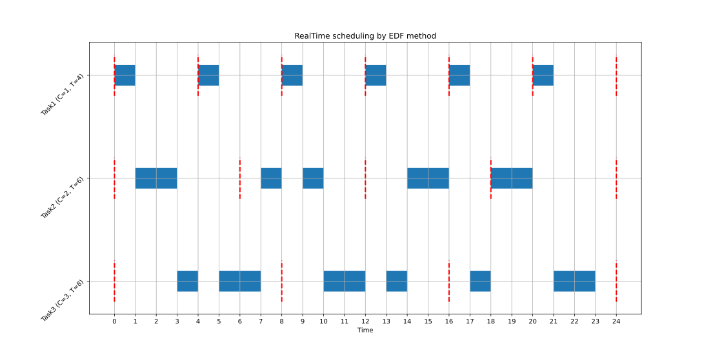

# CPUScheduling
Implementation of CPU scheduling algorithms

In this repository Rate Monotonic (RM) and Earliest Deadline First (EDF) scheduling algorithms have been implemented. Run the `main.py` and enter computation time and each tasks' period. Finally choose one of this two scheduling algorithm and examine if the tasks are schedulable on a single core processor or not. 

Notice that in RM the code sorts all tasks based on their issue time. In other words if a tasks is issueing quickly, it recieves a higher priority.

## Dependencies
Only `numpy` and `matplotlib` libraries are used in the codes.

## Example
Open your terminal. Make sure that you have dependencies. Run the code and test it with this inputs:
```
$ python main.py
Welcome to RealTime Scheduling software :)
Enter the number of tasks: 3
Enter C_i for all 3 tasks respectively:
5 2 2
Enter T_i for all 3 tasks respectively:
20 5 9
What scheduling algorithm do you want to use? (RMFP, EDF): RMFP
Processor Utilization: 0.8722222222222222
This is how tasks are scheduled:
Task1:  [1 1 0 0 0 1 1 0 0 0 1 1 0 0 0]
Task2:  [0 0 1 1 0 0 0 0 0 1 0 0 1 0 0]
Task3:  [0 0 0 0 1 0 0 1 1 0 0 0 0 1 1]
Plotting results...
```
This is the result of scheduling:


As you can see it is schedulable!

Now lets test EDF. Run the main code with foloowing input:
```
$ python main.py
Welcome to RealTime Scheduling software :)
Enter the number of tasks: 3
Enter C_i for all 3 tasks respectively:
1 2 3
Enter T_i for all 3 tasks respectively:
4 6 8
What scheduling algorithm do you want to use? (RMFP, EDF): EDF
Processor Utilization: 0.9583333333333333
This is how tasks are scheduled:
Task1:  [1 0 0 0 1 0 0 0 1 0 0 0 1 0 0 0 1 0 0 0 1 0 0 0]
Task2:  [0 1 1 0 0 0 0 1 0 1 0 0 0 0 1 1 0 0 1 1 0 0 0 0]
Task3:  [0 0 0 1 0 1 1 0 0 0 1 1 0 1 0 0 0 1 0 0 0 1 1 0]
Plotting results...
```

And this is timing diagram:


Notice that the code supposes the deadline of each task is equal to its period. 

If the tasks are not schedulable, the code will let you know. But, it will plot the timing diagram so you can examine if the output is true or not.
